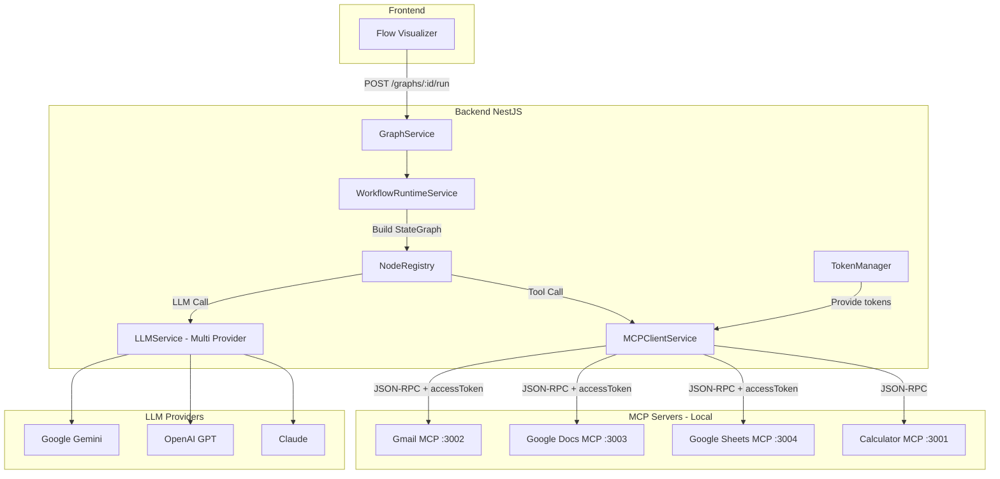

# Graph Workflow Execution với LLM Nodes + MCP Server Integration

> **Confirmed Requirements:**
> - ✅ Dùng **Native SDKs** (openai, @anthropic-ai/sdk, @google/genai)
> - ✅ MCP Servers chạy **local** (remote tính sau)
> - ✅ **Backend quản lý OAuth tokens**
> - ✅ Agent Node: **Full ReAct multi-tool** (multi-turn với tools)
> - ✅ Error Handling: **Retry 3 lần** trước khi abort

---

## Tổng quan bài toán

User gửi một **graph workflow** lên backend với các node:
- **Agent/LLM Node**: chứa `userPrompt`, `provider` (OpenAI, Gemini, Anthropic...), `model` 
- **MCP Tool Nodes**: sử dụng các tools từ MCP servers (Gmail, Google Docs, Sheets...)

Mục tiêu: Kết hợp **LangGraph** để điều phối workflow + **Multi-provider LLM** + **MCP Server tools**.

---

## Kiến trúc đề xuất



---

## Giải thích chi tiết từng thành phần

### 1. Cấu trúc Node Data (Frontend → Backend)

Mỗi node trong graph cần mang đầy đủ thông tin:

```typescript
// types/graph.types.ts
export interface LLMNodeData {
  label: string;
  userPrompt: string;          // Prompt template, có thể chứa {{input}}
  provider: 'gemini' | 'openai' | 'anthropic';
  model: string;               // 'gemini-2.5-flash', 'gpt-4o', 'claude-3-sonnet'
  temperature?: number;
  maxTokens?: number;
}

export interface MCPToolNodeData {
  label: string;
  mcpServer: string;           // 'gmail', 'google-docs', 'google-sheets'
  toolName: string;            // 'sendEmail', 'createDoc', 'appendRow'
  toolArgs: Record<string, any>;
}

export interface AgentNodeData {
  label: string;
  systemPrompt: string;
  provider: 'gemini' | 'openai' | 'anthropic';
  model: string;
  mcpServers: string[];        // List MCP servers agent có thể dùng
  maxIterations?: number;      // Default: 10
}
```

---

### 2. Multi-Provider LLM Service (Native SDKs)

Refactor `llm.service.ts` để hỗ trợ nhiều providers với native SDKs:

```typescript
// services/llm.service.ts
import { Injectable } from '@nestjs/common';
import { GoogleGenAI } from '@google/genai';
import OpenAI from 'openai';
import Anthropic from '@anthropic-ai/sdk';

export interface LLMCallOptions {
  provider: 'gemini' | 'openai' | 'anthropic';
  model: string;
  prompt: string;
  systemPrompt?: string;
  temperature?: number;
  maxTokens?: number;
}

export interface LLMCallWithToolsOptions extends LLMCallOptions {
  tools: ToolDefinition[];
  messages: Message[];
}

export interface ToolDefinition {
  name: string;
  description: string;
  parameters: Record<string, any>;  // JSON Schema
  mcpServer: string;                // Which MCP server owns this tool
}

@Injectable()
export class LLMService {
  private geminiClient: GoogleGenAI;
  private openaiClient: OpenAI;
  private anthropicClient: Anthropic;

  constructor() {
    this.geminiClient = new GoogleGenAI({ apiKey: process.env.GEMINI_API_KEY! });
    this.openaiClient = new OpenAI({ apiKey: process.env.OPENAI_API_KEY });
    this.anthropicClient = new Anthropic({ apiKey: process.env.ANTHROPIC_API_KEY });
  }

  async call(options: LLMCallOptions): Promise<string> {
    const { provider, model, prompt, systemPrompt, temperature, maxTokens } = options;

    switch (provider) {
      case 'gemini':
        return this.callGemini(model, prompt, systemPrompt, temperature, maxTokens);
      case 'openai':
        return this.callOpenAI(model, prompt, systemPrompt, temperature, maxTokens);
      case 'anthropic':
        return this.callAnthropic(model, prompt, systemPrompt, temperature, maxTokens);
      default:
        throw new Error(`Unknown provider: ${provider}`);
    }
  }

  async callWithTools(options: LLMCallWithToolsOptions): Promise<LLMToolResponse> {
    const { provider, model, tools, messages, systemPrompt, temperature, maxTokens } = options;

    switch (provider) {
      case 'gemini':
        return this.callGeminiWithTools(model, messages, tools, systemPrompt, temperature, maxTokens);
      case 'openai':
        return this.callOpenAIWithTools(model, messages, tools, systemPrompt, temperature, maxTokens);
      case 'anthropic':
        return this.callAnthropicWithTools(model, messages, tools, systemPrompt, temperature, maxTokens);
      default:
        throw new Error(`Unknown provider: ${provider}`);
    }
  }

  // ─────────────────────────────────────────────────────────────
  // Private: Gemini
  // ─────────────────────────────────────────────────────────────
  private async callGemini(
    model: string,
    prompt: string,
    systemPrompt?: string,
    temperature?: number,
    maxTokens?: number,
  ): Promise<string> {
    const result = await this.geminiClient.models.generateContent({
      model,
      contents: prompt,
      config: {
        systemInstruction: systemPrompt,
        temperature,
        maxOutputTokens: maxTokens,
      },
    });
    return result.text ?? '';
  }

  private async callGeminiWithTools(
    model: string,
    messages: Message[],
    tools: ToolDefinition[],
    systemPrompt?: string,
    temperature?: number,
    maxTokens?: number,
  ): Promise<LLMToolResponse> {
    const geminiTools = tools.map(t => ({
      name: t.name,
      description: t.description,
      parameters: t.parameters,
    }));

    const result = await this.geminiClient.models.generateContent({
      model,
      contents: messages.map(m => ({ role: m.role, parts: [{ text: m.content }] })),
      config: {
        systemInstruction: systemPrompt,
        temperature,
        maxOutputTokens: maxTokens,
      },
      tools: [{ functionDeclarations: geminiTools }],
    });

    // Parse function calls from response
    const functionCalls = result.candidates?.[0]?.content?.parts
      ?.filter(p => p.functionCall)
      ?.map(p => ({
        name: p.functionCall!.name,
        args: p.functionCall!.args,
        mcpServer: tools.find(t => t.name === p.functionCall!.name)?.mcpServer,
      }));

    return {
      content: result.text ?? '',
      toolCalls: functionCalls || [],
    };
  }

  // ─────────────────────────────────────────────────────────────
  // Private: OpenAI
  // ─────────────────────────────────────────────────────────────
  private async callOpenAI(
    model: string,
    prompt: string,
    systemPrompt?: string,
    temperature?: number,
    maxTokens?: number,
  ): Promise<string> {
    const messages: OpenAI.ChatCompletionMessageParam[] = [];
    if (systemPrompt) messages.push({ role: 'system', content: systemPrompt });
    messages.push({ role: 'user', content: prompt });

    const response = await this.openaiClient.chat.completions.create({
      model,
      messages,
      temperature,
      max_tokens: maxTokens,
    });

    return response.choices[0]?.message?.content ?? '';
  }

  private async callOpenAIWithTools(
    model: string,
    messages: Message[],
    tools: ToolDefinition[],
    systemPrompt?: string,
    temperature?: number,
    maxTokens?: number,
  ): Promise<LLMToolResponse> {
    const openaiMessages: OpenAI.ChatCompletionMessageParam[] = [];
    if (systemPrompt) openaiMessages.push({ role: 'system', content: systemPrompt });
    openaiMessages.push(...messages.map(m => ({ role: m.role as 'user' | 'assistant', content: m.content })));

    const openaiTools: OpenAI.ChatCompletionTool[] = tools.map(t => ({
      type: 'function',
      function: {
        name: t.name,
        description: t.description,
        parameters: t.parameters,
      },
    }));

    const response = await this.openaiClient.chat.completions.create({
      model,
      messages: openaiMessages,
      tools: openaiTools,
      temperature,
      max_tokens: maxTokens,
    });

    const message = response.choices[0]?.message;
    const toolCalls = message?.tool_calls?.map(tc => ({
      name: tc.function.name,
      args: JSON.parse(tc.function.arguments),
      mcpServer: tools.find(t => t.name === tc.function.name)?.mcpServer,
    })) || [];

    return {
      content: message?.content ?? '',
      toolCalls,
    };
  }

  // ─────────────────────────────────────────────────────────────
  // Private: Anthropic
  // ─────────────────────────────────────────────────────────────
  private async callAnthropic(
    model: string,
    prompt: string,
    systemPrompt?: string,
    temperature?: number,
    maxTokens?: number,
  ): Promise<string> {
    const response = await this.anthropicClient.messages.create({
      model,
      max_tokens: maxTokens ?? 4096,
      system: systemPrompt,
      messages: [{ role: 'user', content: prompt }],
      temperature,
    });

    const textBlock = response.content.find(c => c.type === 'text');
    return textBlock?.text ?? '';
  }

  private async callAnthropicWithTools(
    model: string,
    messages: Message[],
    tools: ToolDefinition[],
    systemPrompt?: string,
    temperature?: number,
    maxTokens?: number,
  ): Promise<LLMToolResponse> {
    const anthropicTools: Anthropic.Tool[] = tools.map(t => ({
      name: t.name,
      description: t.description,
      input_schema: t.parameters,
    }));

    const response = await this.anthropicClient.messages.create({
      model,
      max_tokens: maxTokens ?? 4096,
      system: systemPrompt,
      messages: messages.map(m => ({ role: m.role as 'user' | 'assistant', content: m.content })),
      tools: anthropicTools,
      temperature,
    });

    const toolUseBlocks = response.content.filter(c => c.type === 'tool_use');
    const textBlock = response.content.find(c => c.type === 'text');

    return {
      content: textBlock?.text ?? '',
      toolCalls: toolUseBlocks.map(tb => ({
        name: tb.name,
        args: tb.input,
        mcpServer: tools.find(t => t.name === tb.name)?.mcpServer,
      })),
    };
  }
}

export interface LLMToolResponse {
  content: string;
  toolCalls: Array<{
    name: string;
    args: Record<string, any>;
    mcpServer?: string;
  }>;
}

export interface Message {
  role: 'user' | 'assistant' | 'tool';
  content: string;
  toolCallId?: string;
}
```

---

### 3. MCP Client Service với Retry Logic

Service để gọi các MCP servers từ backend với **retry 3 lần**:

```typescript
// services/mcp-client.service.ts
import { Injectable, Logger } from '@nestjs/common';
import { TokenManagerService } from './token-manager.service';

const MAX_RETRIES = 3;
const RETRY_DELAY_MS = 1000;

@Injectable()
export class MCPClientService {
  private readonly logger = new Logger(MCPClientService.name);
  
  // Map: server name → base URL (local)
  private serverUrls = new Map<string, string>([
    ['calculator', 'http://localhost:3001'],
    ['gmail', 'http://localhost:3002'],
    ['google-docs', 'http://localhost:3003'],
    ['google-sheets', 'http://localhost:3004'],
    ['google-search', 'http://localhost:3005'],
    ['google-calendar', 'http://localhost:3006'],
    ['google-slides', 'http://localhost:3007'],
    ['google-drive', 'http://localhost:3008'],
  ]);

  constructor(
    private readonly tokenManager: TokenManagerService,
  ) {}

  async callTool(
    userId: string,
    server: string, 
    toolName: string, 
    args: Record<string, any>,
  ): Promise<any> {
    const baseUrl = this.serverUrls.get(server);
    if (!baseUrl) throw new Error(`Unknown MCP server: ${server}`);

    // Inject accessToken cho Google tools (backend quản lý)
    const enrichedArgs = await this.enrichArgsWithToken(userId, server, args);

    let lastError: Error | null = null;

    for (let attempt = 1; attempt <= MAX_RETRIES; attempt++) {
      try {
        this.logger.debug(`[${server}/${toolName}] Attempt ${attempt}/${MAX_RETRIES}`);
        
        const response = await fetch(`${baseUrl}/mcp`, {
          method: 'POST',
          headers: { 
            'Content-Type': 'application/json',
            'Accept': 'application/json'
          },
          body: JSON.stringify({
            jsonrpc: '2.0',
            method: 'tools/call',
            id: Date.now(),
            params: {
              name: toolName,
              arguments: enrichedArgs,
            }
          })
        });

        if (!response.ok) {
          throw new Error(`HTTP ${response.status}: ${response.statusText}`);
        }

        const result = await response.json();
        
        if (result.error) {
          throw new Error(result.error.message || 'Unknown MCP error');
        }

        this.logger.debug(`[${server}/${toolName}] Success on attempt ${attempt}`);
        return result.result;

      } catch (error) {
        lastError = error as Error;
        this.logger.warn(`[${server}/${toolName}] Attempt ${attempt} failed: ${lastError.message}`);
        
        if (attempt < MAX_RETRIES) {
          await this.delay(RETRY_DELAY_MS * attempt); // Exponential backoff
        }
      }
    }

    this.logger.error(`[${server}/${toolName}] All ${MAX_RETRIES} attempts failed`);
    throw new Error(`MCP tool call failed after ${MAX_RETRIES} retries: ${lastError?.message}`);
  }

  async listTools(server: string): Promise<ToolDefinition[]> {
    const baseUrl = this.serverUrls.get(server);
    if (!baseUrl) throw new Error(`Unknown MCP server: ${server}`);

    const response = await fetch(`${baseUrl}/mcp`, {
      method: 'POST',
      headers: { 
        'Content-Type': 'application/json',
        'Accept': 'application/json'
      },
      body: JSON.stringify({
        jsonrpc: '2.0',
        method: 'tools/list',
        id: Date.now(),
      })
    });

    const result = await response.json();
    if (result.error) throw new Error(result.error.message);

    return result.result.tools.map((tool: any) => ({
      name: tool.name,
      description: tool.description,
      parameters: tool.inputSchema,
      mcpServer: server,
    }));
  }

  async getToolsFromServers(servers: string[]): Promise<ToolDefinition[]> {
    const allTools: ToolDefinition[] = [];
    
    for (const server of servers) {
      try {
        const tools = await this.listTools(server);
        allTools.push(...tools);
      } catch (error) {
        this.logger.warn(`Failed to list tools from ${server}: ${error}`);
      }
    }

    return allTools;
  }

  private async enrichArgsWithToken(
    userId: string,
    server: string,
    args: Record<string, any>,
  ): Promise<Record<string, any>> {
    // Các Google services cần accessToken
    const googleServices = ['gmail', 'google-docs', 'google-sheets', 'google-calendar', 'google-slides', 'google-drive'];
    
    if (googleServices.includes(server)) {
      const accessToken = await this.tokenManager.getAccessToken(userId, 'google');
      return { ...args, accessToken };
    }

    return args;
  }

  private delay(ms: number): Promise<void> {
    return new Promise(resolve => setTimeout(resolve, ms));
  }
}

interface ToolDefinition {
  name: string;
  description: string;
  parameters: Record<string, any>;
  mcpServer: string;
}
```

---

### 4. Token Manager Service (Backend quản lý OAuth)

```typescript
// services/token-manager.service.ts
import { Injectable, Logger } from '@nestjs/common';
import { InjectModel } from '@nestjs/mongoose';
import { Model } from 'mongoose';
import { UserToken, UserTokenDocument } from '../schemas/user-token.schema';

@Injectable()
export class TokenManagerService {
  private readonly logger = new Logger(TokenManagerService.name);

  constructor(
    @InjectModel(UserToken.name)
    private readonly tokenModel: Model<UserTokenDocument>,
  ) {}

  async getAccessToken(userId: string, provider: 'google'): Promise<string> {
    const token = await this.tokenModel.findOne({ 
      userId, 
      provider 
    });

    if (!token) {
      throw new Error(`No ${provider} token found for user. Please authenticate first.`);
    }

    // Check if token is expired
    if (this.isExpired(token.expiresAt)) {
      this.logger.debug(`Token expired for user ${userId}, refreshing...`);
      return this.refreshToken(userId, provider, token.refreshToken);
    }

    return token.accessToken;
  }

  async saveToken(
    userId: string,
    provider: 'google',
    accessToken: string,
    refreshToken: string,
    expiresAt: Date,
  ): Promise<void> {
    await this.tokenModel.findOneAndUpdate(
      { userId, provider },
      { accessToken, refreshToken, expiresAt },
      { upsert: true },
    );
  }

  private isExpired(expiresAt: Date): boolean {
    return new Date() >= new Date(expiresAt.getTime() - 5 * 60 * 1000); // 5 min buffer
  }

  private async refreshToken(
    userId: string,
    provider: 'google',
    refreshToken: string,
  ): Promise<string> {
    // Call Google OAuth refresh endpoint
    const response = await fetch('https://oauth2.googleapis.com/token', {
      method: 'POST',
      headers: { 'Content-Type': 'application/x-www-form-urlencoded' },
      body: new URLSearchParams({
        client_id: process.env.GOOGLE_CLIENT_ID!,
        client_secret: process.env.GOOGLE_CLIENT_SECRET!,
        refresh_token: refreshToken,
        grant_type: 'refresh_token',
      }),
    });

    const data = await response.json();
    
    if (data.error) {
      throw new Error(`Failed to refresh token: ${data.error_description}`);
    }

    const expiresAt = new Date(Date.now() + data.expires_in * 1000);
    await this.saveToken(userId, provider, data.access_token, refreshToken, expiresAt);

    return data.access_token;
  }
}
```

---

### 5. Node Registry - Factory Pattern với Multi-Tool Agent

Mở rộng `node.registry.ts` để hỗ trợ **ReAct multi-tool agent**:

```typescript
// registry/node.registry.ts
import { Injectable, Logger } from '@nestjs/common';
import { WorkflowState } from '../types/langraph.types';
import { LLMService, ToolDefinition, Message } from '../services/llm.service';
import { MCPClientService } from '../services/mcp-client.service';
import { LLMNodeData, MCPToolNodeData, AgentNodeData } from '../types/graph.types';

const MAX_AGENT_ITERATIONS = 10;

@Injectable()
export class NodeRegistry {
  private readonly logger = new Logger(NodeRegistry.name);

  constructor(
    private readonly llmService: LLMService,
    private readonly mcpClient: MCPClientService,
  ) {}

  // ─────────────────────────────────────────────────────────────
  // Factory: LLM Node (simple prompt → response)
  // ─────────────────────────────────────────────────────────────
  createLLMNode(nodeData: LLMNodeData) {
    return async (state: WorkflowState) => {
      const finalPrompt = this.interpolateTemplate(nodeData.userPrompt, state);

      const output = await this.llmService.call({
        provider: nodeData.provider,
        model: nodeData.model,
        prompt: finalPrompt,
        temperature: nodeData.temperature,
        maxTokens: nodeData.maxTokens,
      });

      return { ...state, output };
    };
  }

  // ─────────────────────────────────────────────────────────────
  // Factory: MCP Tool Node (direct tool call)
  // ─────────────────────────────────────────────────────────────
  createMCPToolNode(nodeData: MCPToolNodeData, userId: string) {
    return async (state: WorkflowState) => {
      const args = this.interpolateArgs(nodeData.toolArgs, state);

      const result = await this.mcpClient.callTool(
        userId,
        nodeData.mcpServer,
        nodeData.toolName,
        args,
      );

      return { 
        ...state, 
        output: typeof result === 'string' ? result : JSON.stringify(result),
        context: { ...state.context, toolResult: result },
      };
    };
  }

  // ─────────────────────────────────────────────────────────────
  // Factory: Agent Node (ReAct multi-tool loop)
  // ─────────────────────────────────────────────────────────────
  createAgentNode(nodeData: AgentNodeData, userId: string) {
    return async (state: WorkflowState) => {
      const maxIterations = nodeData.maxIterations ?? MAX_AGENT_ITERATIONS;
      
      // 1. Lấy available tools từ các MCP servers
      const tools = await this.mcpClient.getToolsFromServers(nodeData.mcpServers);
      this.logger.debug(`Agent has access to ${tools.length} tools`);

      // 2. Initialize conversation
      const messages: Message[] = [
        { role: 'user', content: state.input },
      ];

      // 3. ReAct loop
      for (let iteration = 0; iteration < maxIterations; iteration++) {
        this.logger.debug(`Agent iteration ${iteration + 1}/${maxIterations}`);

        // Call LLM with tools
        const response = await this.llmService.callWithTools({
          provider: nodeData.provider,
          model: nodeData.model,
          prompt: state.input,
          systemPrompt: nodeData.systemPrompt,
          messages,
          tools,
        });

        // If no tool calls, we're done
        if (!response.toolCalls || response.toolCalls.length === 0) {
          this.logger.debug('Agent finished - no more tool calls');
          return { 
            ...state, 
            output: response.content,
            messages: [...state.messages, ...messages, { role: 'assistant', content: response.content }],
          };
        }

        // Add assistant message
        messages.push({ role: 'assistant', content: response.content || `Calling ${response.toolCalls.length} tool(s)...` });

        // Execute each tool call
        for (const toolCall of response.toolCalls) {
          this.logger.debug(`Executing tool: ${toolCall.mcpServer}/${toolCall.name}`);
          
          try {
            const toolResult = await this.mcpClient.callTool(
              userId,
              toolCall.mcpServer!,
              toolCall.name,
              toolCall.args,
            );

            // Add tool result to conversation
            messages.push({
              role: 'tool',
              content: typeof toolResult === 'string' ? toolResult : JSON.stringify(toolResult),
              toolCallId: toolCall.name,
            });

          } catch (error) {
            this.logger.error(`Tool ${toolCall.name} failed: ${error}`);
            messages.push({
              role: 'tool',
              content: `Error: ${error}`,
              toolCallId: toolCall.name,
            });
          }
        }
      }

      // Max iterations reached
      this.logger.warn('Agent reached max iterations');
      return {
        ...state,
        output: 'Agent reached maximum iterations without completing.',
        error: 'MAX_ITERATIONS_REACHED',
      };
    };
  }

  // ─────────────────────────────────────────────────────────────
  // Helpers
  // ─────────────────────────────────────────────────────────────
  private interpolateTemplate(template: string, state: WorkflowState): string {
    return template
      .replace(/\{\{input\}\}/g, state.input)
      .replace(/\{\{output\}\}/g, state.output ?? '')
      .replace(/\{\{context\.(\w+)\}\}/g, (_, key) => state.context?.[key] ?? '');
  }

  private interpolateArgs(args: Record<string, any>, state: WorkflowState): Record<string, any> {
    const result: Record<string, any> = {};
    
    for (const [key, value] of Object.entries(args)) {
      if (typeof value === 'string') {
        result[key] = this.interpolateTemplate(value, state);
      } else {
        result[key] = value;
      }
    }

    return result;
  }
}
```

---

### 6. Dynamic Workflow Builder

Refactor `workflow.service.ts` để build graph động từ user config:

```typescript
// services/workflow.service.ts
import {
  StateGraph,
  START,
  END,
  Annotation,
} from "@langchain/langgraph";
import { Injectable, Logger } from "@nestjs/common";
import { GraphDocument } from "../schemas/graphs.schema";
import { NodeRegistry } from "../registry/node.registry";
import { FlowNode, LLMNodeData, MCPToolNodeData, AgentNodeData } from "../types/graph.types";
import { Message } from "./llm.service";

export const State = Annotation.Root({
  input: Annotation<string>({
    reducer: (prev, next) => next ?? prev ?? '',
    default: () => '',
  }),

  output: Annotation<string | undefined>({
    reducer: (_, next) => next,
  }),

  // Agent conversation history
  messages: Annotation<Message[]>({
    reducer: (prev, next) => [...(prev ?? []), ...(next ?? [])],
    default: () => [],
  }),

  // Context to pass data between nodes
  context: Annotation<Record<string, any>>({
    reducer: (prev, next) => ({ ...(prev ?? {}), ...(next ?? {}) }),
    default: () => ({}),
  }),

  // Error tracking
  error: Annotation<string | undefined>({
    reducer: (_, next) => next,
  }),
});

export type WorkflowState = typeof State.State;

@Injectable()
export class WorkflowRuntimeService {
  private readonly logger = new Logger(WorkflowRuntimeService.name);

  constructor(private readonly nodeRegistry: NodeRegistry) {}

  build(graph: GraphDocument, userId: string) {
    const runtime = new StateGraph(State);

    // Build adjacency list from edges
    const adjList = this.buildAdjacencyList(graph.edges);
    
    // Find special nodes
    const startNode = graph.nodes.find(n => n.type === 'start');
    const endNode = graph.nodes.find(n => n.type === 'end');

    if (!startNode || !endNode) {
      throw new Error('Graph must have start and end nodes');
    }

    // Add nodes based on type
    for (const node of graph.nodes) {
      const handler = this.createNodeHandler(node, userId);
      if (handler) {
        this.logger.debug(`Adding node: ${node.id} (${node.type})`);
        runtime.addNode(node.id, handler);
      }
    }

    // Add edges
    const firstNodeId = adjList.get(startNode.id)?.[0];
    if (firstNodeId && firstNodeId !== endNode.id) {
      this.logger.debug(`Adding edge: START -> ${firstNodeId}`);
      runtime.addEdge(START, firstNodeId as any);
    }

    for (const edge of graph.edges) {
      // Skip edges from start node (already handled)
      if (edge.source === startNode.id) continue;
      
      if (edge.target === endNode.id) {
        this.logger.debug(`Adding edge: ${edge.source} -> END`);
        runtime.addEdge(edge.source as any, END);
      } else {
        this.logger.debug(`Adding edge: ${edge.source} -> ${edge.target}`);
        runtime.addEdge(edge.source as any, edge.target as any);
      }
    }

    return runtime.compile();
  }

  async *runStream(graph: GraphDocument, userId: string, input: string): AsyncGenerator<any> {
    const app = this.build(graph, userId);

    const initialState: WorkflowState = {
      input,
      output: undefined,
      messages: [],
      context: {},
      error: undefined,
    };

    const stream = await app.stream(initialState);

    for await (const event of stream) {
      yield event;
    }
  }

  private createNodeHandler(node: FlowNode, userId: string) {
    switch (node.type) {
      case 'llm':
        return this.nodeRegistry.createLLMNode(node.data as LLMNodeData);
      case 'mcp-tool':
        return this.nodeRegistry.createMCPToolNode(node.data as MCPToolNodeData, userId);
      case 'agent':
        return this.nodeRegistry.createAgentNode(node.data as AgentNodeData, userId);
      case 'start':
      case 'end':
        return null; // No handler needed
      default:
        throw new Error(`Unknown node type: ${node.type}`);
    }
  }

  private buildAdjacencyList(edges: any[]): Map<string, string[]> {
    const adjList = new Map<string, string[]>();
    
    for (const edge of edges) {
      if (!adjList.has(edge.source)) {
        adjList.set(edge.source, []);
      }
      adjList.get(edge.source)!.push(edge.target);
    }

    return adjList;
  }
}
```

---

## Workflow State mở rộng

```typescript
// types/langraph.types.ts
export interface WorkflowState {
  input: string;
  output?: string;
  messages: Message[];
  context: Record<string, any>;
  error?: string;
}

export interface Message {
  role: 'user' | 'assistant' | 'tool';
  content: string;
  toolCallId?: string;
}
```

---

## Example Flow: Agent với Multi-Tool

```
┌─────────┐     ┌────────────────────────────────────┐     ┌─────────┐
│  START  │ ──▶ │           Agent Node               │ ──▶ │   END   │
│         │     │ systemPrompt: "You are helpful..." │     │         │
└─────────┘     │ provider: openai                   │     └─────────┘
                │ model: gpt-4o                      │
                │ mcpServers: [gmail, google-sheets] │
                │ maxIterations: 10                  │
                └────────────────────────────────────┘
                        │
                        ▼
            ┌───────────────────────────┐
            │      ReAct Loop           │
            │                           │
            │  1. User: "Send summary   │
            │     of my emails to       │
            │     spreadsheet"          │
            │                           │
            │  2. LLM decides:          │
            │     Call gmail/listEmails │
            │                           │
            │  3. Tool result returned  │
            │                           │
            │  4. LLM decides:          │
            │     Call sheets/appendRow │
            │                           │
            │  5. Tool result returned  │
            │                           │
            │  6. LLM: "Done! I've..."  │
            │     (no more tool calls)  │
            └───────────────────────────┘
```

---

## Proposed Changes Summary

### Backend - Services

| File | Action | Description |
|------|--------|-------------|
| [llm.service.ts](file:///e:/Career/Software_Engineer/Projects/mcp/backend/src/modules/graphs/services/llm.service.ts) | MODIFY | Add OpenAI + Anthropic SDKs, `callWithTools()` method |
| [mcp-client.service.ts](file:///e:/Career/Software_Engineer/Projects/mcp/backend/src/modules/graphs/services/mcp-client.service.ts) | NEW | HTTP client with retry 3 times |
| [token-manager.service.ts](file:///e:/Career/Software_Engineer/Projects/mcp/backend/src/modules/graphs/services/token-manager.service.ts) | NEW | Backend OAuth token management |
| [node.registry.ts](file:///e:/Career/Software_Engineer/Projects/mcp/backend/src/modules/graphs/registry/node.registry.ts) | MODIFY | Factory methods + ReAct agent |
| [workflow.service.ts](file:///e:/Career/Software_Engineer/Projects/mcp/backend/src/modules/graphs/services/workflow.service.ts) | MODIFY | Dynamic graph building |

### Backend - Types

| File | Action | Description |
|------|--------|-------------|
| [graph.types.ts](file:///e:/Career/Software_Engineer/Projects/mcp/backend/src/modules/graphs/types/graph.types.ts) | MODIFY | Add node data interfaces |
| [langraph.types.ts](file:///e:/Career/Software_Engineer/Projects/mcp/backend/src/modules/graphs/types/langraph.types.ts) | MODIFY | Extended WorkflowState |

### Backend - Schemas

| File | Action | Description |
|------|--------|-------------|
| [user-token.schema.ts](file:///e:/Career/Software_Engineer/Projects/mcp/backend/src/modules/graphs/schemas/user-token.schema.ts) | NEW | MongoDB schema for OAuth tokens |

---

## Dependencies cần cài

```bash
cd backend
npm install openai @anthropic-ai/sdk
```

---

## Verification Plan

### Unit Tests
```bash
npm run test -- --grep "LLMService"
npm run test -- --grep "MCPClientService"
npm run test -- --grep "NodeRegistry"
```

### Integration Test
1. Start MCP servers: `cd mcp_servers && npm run dev`
2. Start backend: `cd backend && npm run start:dev`
3. Create test graph với Agent node + MCP tools
4. POST `/graphs/:id/run` với input
5. Verify agent executes tools và returns result

### Manual Testing
- Test với different providers (gemini, openai, anthropic)
- Test MCP tool calls với retry (kill server thử)
- Test agent loop với multiple tools
- Test OAuth token refresh
